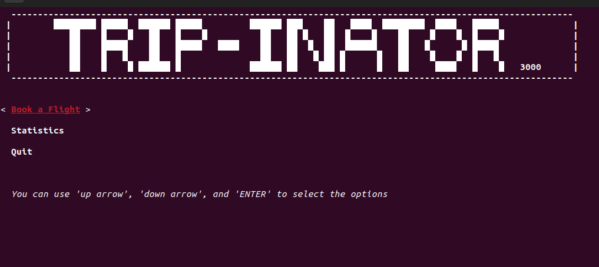
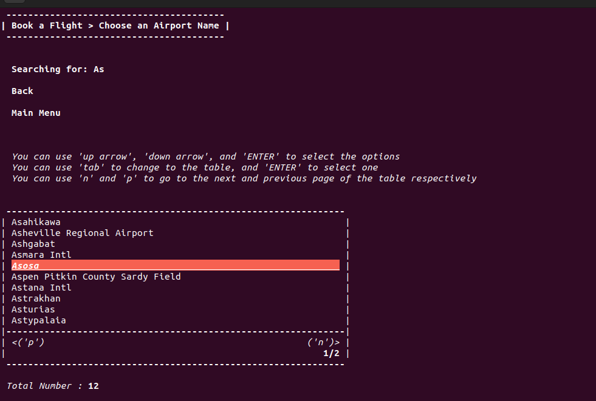
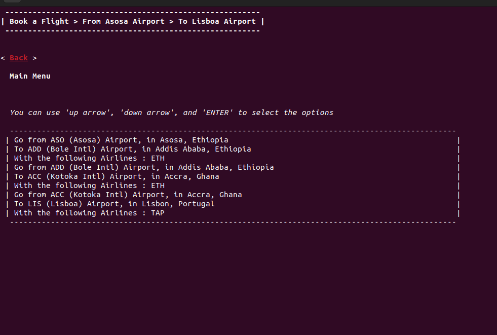
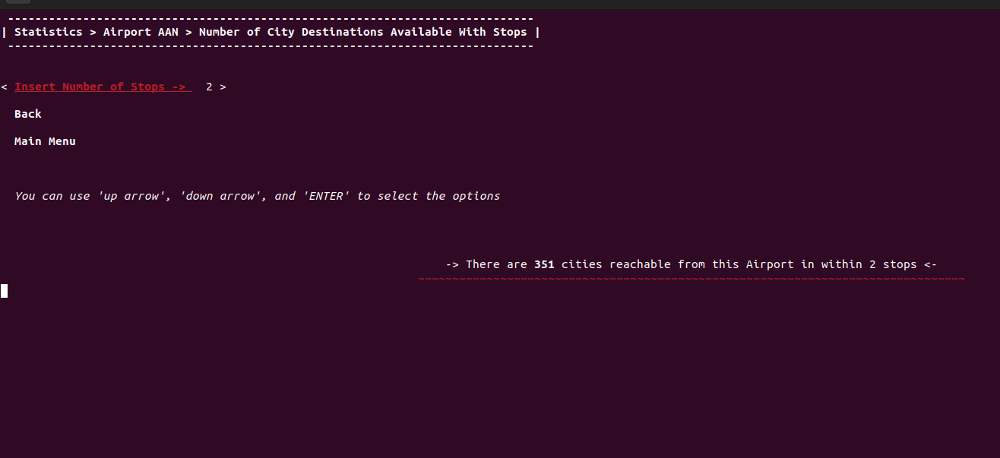

# AED-proj-2

AED-proj-2 is a graph-based pathfinding application where nodes represent airports and edges represent available routes operated by various airlines. Users can search by airline, city, or airport, select departure and destination points, and the program will compute the optimal route based on your preferences.

## Features

* **Search functionality:** Find airports by city name, airport code, or airline.
* **Customizable preferences:** Optimize routes by shortest distance, fewest stops, or preferred airlines.
* **Graph data structure:** Efficiently manages nodes (airports) and weighted edges (flights).
* **Interactive interface:** Command-line prompts guide you through selecting origin, destination, and optimization criteria.

## Requirements

* C++14-compatible compiler
* CMake 3.26 or newer

## Building the Project

```bash
mkdir build && cd build
cmake -DCMAKE_BUILD_TYPE=Release ..
cmake --build .
```

For Debug mode (with AddressSanitizer enabled):

```bash
cmake -DCMAKE_BUILD_TYPE=Debug ..
cmake --build .
```

## Usage

```bash
./AED-proj-2
```

* The program uses a built-in dataset.
* Follow the on-screen prompts to search by airline, city, or airport; select your origin and destination; and choose optimization criteria.

## Screenshots






## License

This project is licensed under the MIT License.
